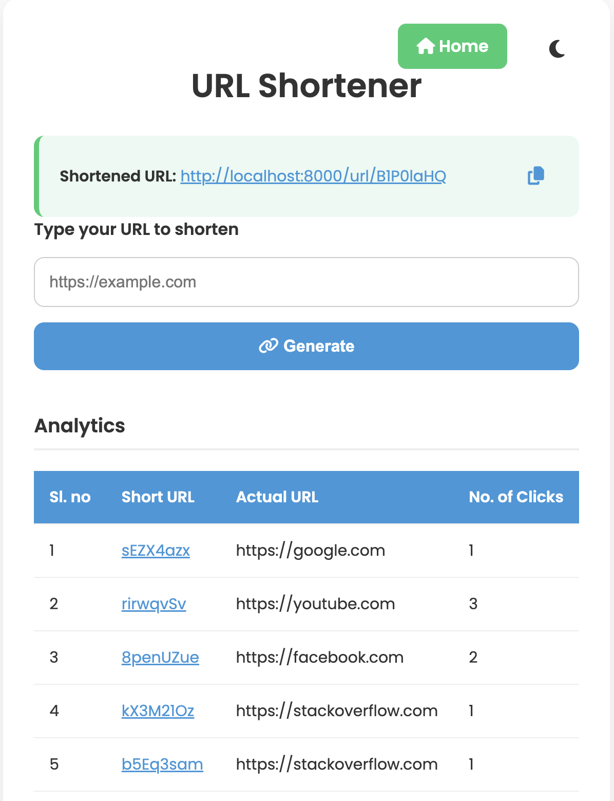
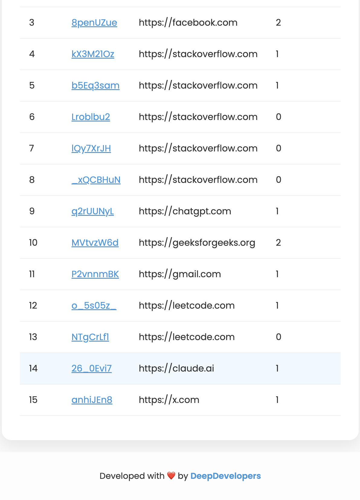

# 🔗 URL Shortener

A simple and beautiful Node.js URL shortener that generates short links and tracks clicks with analytics.





## 🚀 Features
- 🔗 Shorten long URLs
- 📊 Click analytics
- 🌙 Dark mode
- 🎨 Clean and animated UI

## 🧰 Tech Stack
- Node.js + Express
- MongoDB with Mongoose
- EJS for views
- HTML/CSS

## 📦 Installation

```bash
git clone https://github.com/chiradeep98/URL-Shortener.git
cd URL-Shortener
npm install
npm start
